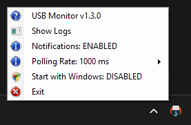
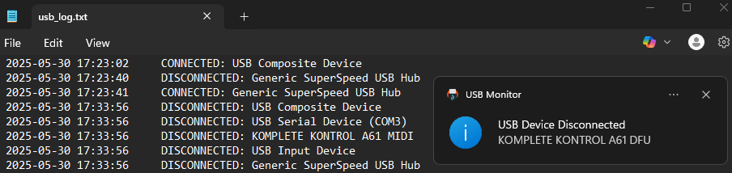

  

<h1 align="center">
  USB Monitor
</h1>

  Monitor USB device activity on Windows - with tray notifications, logging, and auto-start.

  
  
  
  
  
  

  
   
  <i>Tray icon with the available options</i>
   
    
  
   
  <i>Example of a notification and some contents of the log file</i>

## 🔌 Overview

USB Monitor is a lightweight, portable PowerShell utility designed to track USB device events on Windows with no external dependencies. It runs in the system tray and logs all activity to a file for future reference. It’s ideal for:

- Identifying which USB devices connect and disconnect over time
- Diagnosing intermittent USB issues

### Features

- ⚡ Real-time monitoring of USB device connections and disconnections
- 💬 Optional balloon notifications displaying device names
- 🔄 Optional automatic startup with Windows for continuous monitoring
- 🕒 Customizable polling rate interval
- 🖱️ Tray icon menu providing quick access to all functions
- 🗃️ Comprehensive log file saved at `%AppData%\USBMonitor\usb_log.txt`
- 💾 Persistent preferences stored in JSON at `%AppData%\USBMonitor\settings.json`
- 🧠 Single-instance enforcement to prevent multiple runs
- 🧩 No external dependencies, pure PowerShell

## 📋 How to use

### Installation

1. Download the latest version from the [Releases page](https://github.com/joanroig/usb-monitor/releases).
2. Extract the `.exe` file and double-click it to launch the app. The application runs in the background and places an icon in the system tray to manage it.

### Usage

1. Right-click the tray icon to open the log file, configure the settings or quit the app.
2. If enabled, balloon notifications will appear for each USB device connection or disconnection. All activity is always stored in the log file.

## 🛠️ Development Setup

### Prerequisites

- Ensure you have **PowerShell 5.1 or later** installed on your Windows machine.  
  Windows 10+ includes this by default, but you can also use [PowerShell 7+](https://aka.ms/powershell) for enhanced features.

- Clone the repository locally:  
  `git clone https://github.com/joanroig/usb-monitor.git`  
  `cd usb-monitor`

### Running the Application

To run the USB Monitor script directly without building an executable, execute:

`powershell -ExecutionPolicy Bypass -File .\USBMonitor.ps1`

This starts the application in your current session.

### Building the Executable

USB Monitor uses **ps2exe** to package the PowerShell script as a standalone `.exe`:

1. Install the ps2exe module (requires internet):
   `Install-Module -Name ps2exe -Scope CurrentUser -Force`

2. Run the build script to generate the executable:  
   `.\bundle.ps1`  
   This script packages `USBMonitor.ps1` into an optimized executable located in the `dist` folder.

### Debugging with VSCode

VSCode launch configurations are provided in `.vscode/launch.json`:

- **PowerShell: Launch USBMonitor**  
  Runs `USBMonitor.ps1` directly for live debugging with breakpoints and console output.

- **PowerShell: Bundle USBMonitor**  
  Executes the build script (`bundle.ps1`) to create the executable, useful for verifying packaging steps.

To use these, open VSCode in the project directory, then open the Run and Debug panel and select the desired configuration.

### Automated Release

Releases are fully automated via GitHub Actions. Check out the workflow defined in [`create-release.yml`](.github/workflows/create-release.yml), which builds and publishes new executables on the GitHub releases page.

## 🙏 Credits

Icon from <a href="https://www.flaticon.com/free-icons/usb-flash-drive" title="usb-flash-drive icons">Flaticon</a> by Freepik.

## 📄 License

This project is licensed under the MIT License. See the [LICENSE](LICENSE) file for more information.
